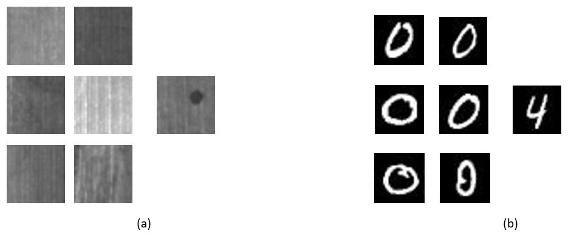
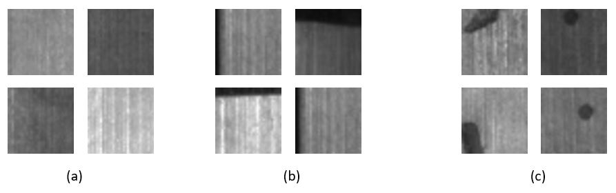
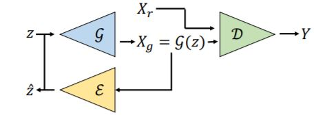

# unsupervised_anomaly_detection

## Existing Approaches 

We can classify the existing approaches for "unsupervised" anomaly/outlier detection based on (at least) two criterias:

- The "contamination" of the training dataset

    Based on this criteria, each approach will assume one of the following:

    - Contaminated dataset: the training dataset contains both normal and anamolous elements. 
    - Uncontaminated dataset: The training dataset contains only normal samples. Such approach is also refered as weakly supervised.

- How far is the distribution of the anomalous samples to the normal samples

    - If the anamolous samples lie far away from the normal distribution (as shown in (b)), the problem is known is as out of distribution detection (OoDD) . Note that OoDD is sometimes refered as a seperate problem and not included in the family of anomaly deteion, but here I will assume that the OoDD detection problem lies under the anomaly detection umberlla.

    - On the other hand, if  the anamolous samples lie at the boundaries of normal distribution (as shown in (b)), I will refer to the problem as fault detection (FD).

Note that to the best of my knowledge, there is no existing approach that tackles the problem of fault detection(FD) assuming a contaminated dataset.

## UFDGAN 

#### Assumptions: 
- Contaminated training set 
- Fault detection (not OoDD)
- The fault percentage is known

#### Why the problem is quasi unsolvoble even for a human?
Let's take the MTSD dataset as an example. As shown in the figure bellow,
- (a) is a sample of a majority pattern within the normal data
- (b) is a sample of a minority pattern within the normal data 
- (c) is a sample of a the faulty data (a minority)

So, the normal samples are in somehow "multi-modal". In this settings, it is challenging even for a human to correctly detect the anomalous samples.

So, I argue that the problem of unsupervised fault detection assuming a contaminated training dataset is challenging even for a human being. And in order to be solvoble, the data distribution should be exactly a mixture of ONLY two salient modes, which may rarely be the case in the real world.

#### Out of Distribution Detection instead of Fault detection

We adopt the same assumptions as the UFDGAN paper, but we tackle the problem of OoDD.

#### Approach: OoDD through GAN's Mode Collapse
The model is composed of a GAN (generator and a discriminator), along with an encoder. The encoder tries to learn the reverse mapping from the image space to the gan's latent space. The three models are trained jointly. At each iteration, based on the reconstruction error, the top p% samples with biggest reconstruction error (from the real data) are filtered out during training. As the training goes, and as the the idea is to benefit from one of GAN's biggest weaknesses, which is the mode collapse.

#### Dataset & Preleminary Results
The MNIST dataset is used. The 0 is used as the normal class and randomly sampled elements from the different other classes as out of distribution data. The OoD percentage is 5%. A preliminary experiment gives a recall of 0.9 and accuracy of 0.98.

